# Backend Architecture Documentation

## 1. System Overview

### 1.1 Core Components


## 2. Project Structure

### 2.1 Package Organization
```
com.xml.processor/
├── annotation/      # Custom annotations
├── aspect/         # AOP aspects
├── config/         # Configuration classes
├── controller/     # REST controllers
├── converter/      # Data converters
├── dto/           # Data Transfer Objects
├── exception/     # Custom exceptions
├── filter/        # Security filters
├── mapper/        # Data mappers
├── model/         # Domain models
├── repository/    # Data access layer
├── security/      # Security configuration
├── service/       # Business logic
│   └── strategy/  # Document processing strategies
└── validation/    # Validation logic
```

## 3. Component Responsibilities

### 3.1 Security Layer
- **JwtAuthenticationFilter**
  - Location: `security/filter/JwtAuthenticationFilter.java`
  - Responsibilities:
    1. Extract JWT from request
    2. Validate token
    3. Load user details
    4. Set authentication context

- **ClientContextFilter**
  - Location: `filter/ClientContextFilter.java`
  - Responsibilities:
    1. Extract client context from request
    2. Validate client access
    3. Set client context holder

### 3.2 Document Processing Strategies
- **AsnDocumentProcessingStrategy**
  - Location: `service/strategy/AsnDocumentProcessingStrategy.java`
  - Responsibilities:
    1. Process ASN XML documents
    2. Apply mapping rules dynamically
    3. Transform data according to rules
    4. Handle header and line items
    5. Validate XML paths
    6. Store processed data

### 3.3 Mapping Rules
- **MappingRuleService**
  - Location: `service/impl/MappingRuleServiceImpl.java`
  - Responsibilities:
    1. Load client-specific mapping rules
    2. Validate XML paths
    3. Apply transformations
    4. Handle different table types (ASN_HEADERS, ASN_LINES)

### 3.4 Controllers Layer
- **AuthController**
  - Location: `controller/AuthController.java`
  - Endpoints:
    * POST `/api/auth/login`
    * POST `/api/auth/logout`
    * POST `/api/auth/refresh`
    * GET `/api/auth/validate`

- **ClientController**
  - Location: `controller/ClientController.java`
  - Endpoints:
    * GET `/api/clients`
    * POST `/api/clients`
    * GET `/api/clients/{id}`
    * PUT `/api/clients/{id}`
    * DELETE `/api/clients/{id}`

### 3.5 Service Layer
- **JwtService**
  - Location: `security/service/JwtService.java`
  - Responsibilities:
    1. Generate access tokens
    2. Generate refresh tokens
    3. Validate tokens
    4. Extract claims
    5. Handle token blacklisting

- **UserService**
  - Location: `service/impl/UserServiceImpl.java`
  - Responsibilities:
    1. User CRUD operations
    2. Password management
    3. Role management
    4. User authentication

- **ClientService**
  - Location: `service/impl/ClientServiceImpl.java`
  - Responsibilities:
    1. Client CRUD operations
    2. Client validation
    3. Client context management

## 4. Process Flows

### 4.1 Application Startup


### 4.2 Request Processing


### 4.3 ASN Document Processing


### 4.4 Dynamic Mapping Flow

```mermaid
graph TB
    XML[XML Document] --> Rules[Load Rules]
    Rules --> Headers[Process Headers]
    Rules --> Lines[Process Lines]
    Headers --> Validate[Validate Data]
    Lines --> Validate
    Validate --> Store[Store Results]
```


## 5. Security Configuration

### 5.1 Filter Chain Order
1. CorsFilter (Order: -100)
2. ClientContextFilter (Order: 1)
3. JwtAuthenticationFilter (Order: 2)
4. CsrfFilter (Order: 3)

### 5.2 Security Rules
```java
.authorizeHttpRequests(auth -> auth
    .requestMatchers("/api/auth/**").permitAll()
    .requestMatchers(HttpMethod.GET, "/api/clients/**").hasAnyRole("ADMIN", "USER")
    .requestMatchers(HttpMethod.POST, "/api/clients/**").hasRole("ADMIN")
    .requestMatchers(HttpMethod.PUT, "/api/clients/**").hasRole("ADMIN")
    .requestMatchers(HttpMethod.DELETE, "/api/clients/**").hasRole("ADMIN")
    .anyRequest().authenticated()
)
```

## 6. Data Flow

### 6.1 Client Creation Process


### 6.2 Authentication Process


## 7. Error Handling

### 7.1 Global Exception Handling


## 8. Database Operations

### 8.1 Transaction Flow


## 9. Initialization Process

### 9.1 Application Bootstrap
1. Load application.properties
2. Initialize Security Configuration
3. Set up Database Connection
4. Register Filters
5. Initialize Services
6. Load Default Data
7. Start Web Server

### 9.2 Default Data Creation


### 9.3 Upload file process


Dynamic Processing Flow


## 10. Current Implementation Status

### 10.1 Completed Features
- Project structure setup
- Authentication framework
- Role-based access control
- CSRF protection
- Client CRUD operations
- ASN document processing
- Dynamic mapping rules
- XML path validation
- Header and line processing
- Interface management
- Mapping rules system
- Enhanced error handling
- Improved logging
- Performance optimization
- Testing coverage
- Documentation updates

### 10.2 In Progress
- Additional document type support
- Enhanced validation rules
- Performance optimization
- Error handling improvements
- Testing coverage
- Documentation updates

### 10.3 Known Issues
1. XML path validation edge cases
2. Mapping rule priority handling
3. Error message standardization
4. Performance optimization needed
5. Documentation updates required

### 10.4 Next Steps
1. Add support for additional document types
2. Enhance validation rules
3. Optimize performance
4. Improve error handling
5. Add comprehensive testing
6. Update documentation 